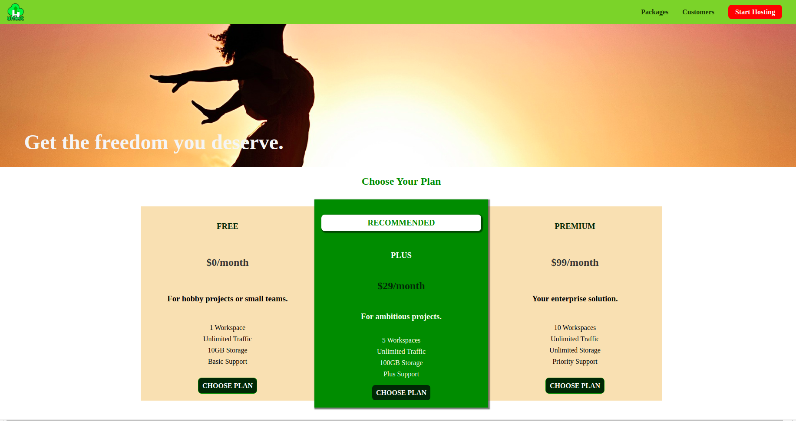
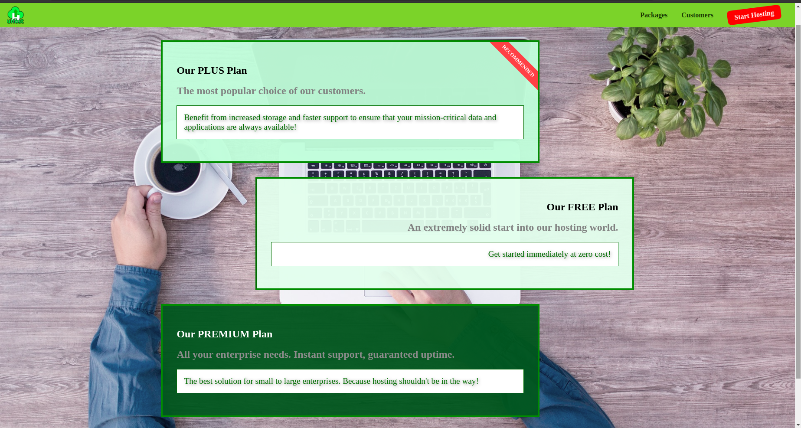
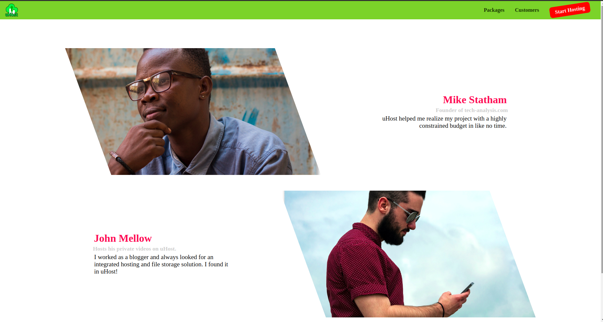
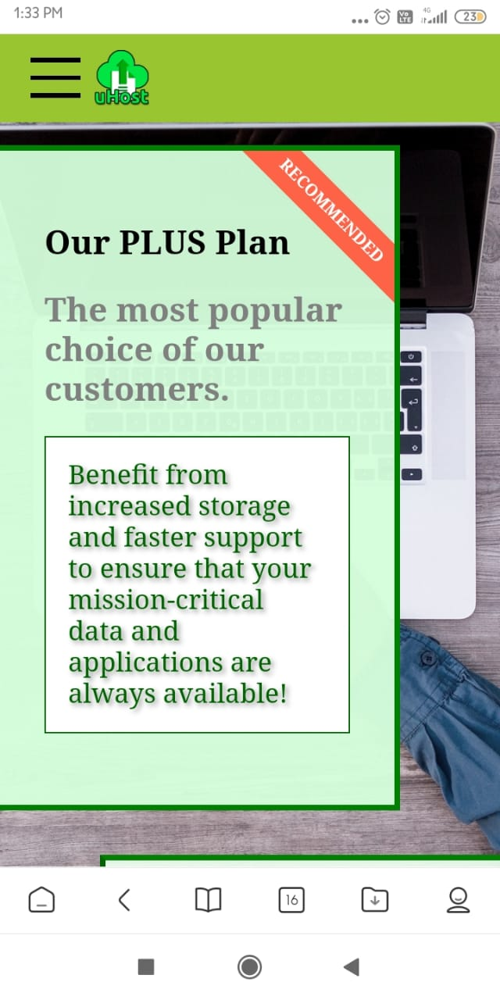
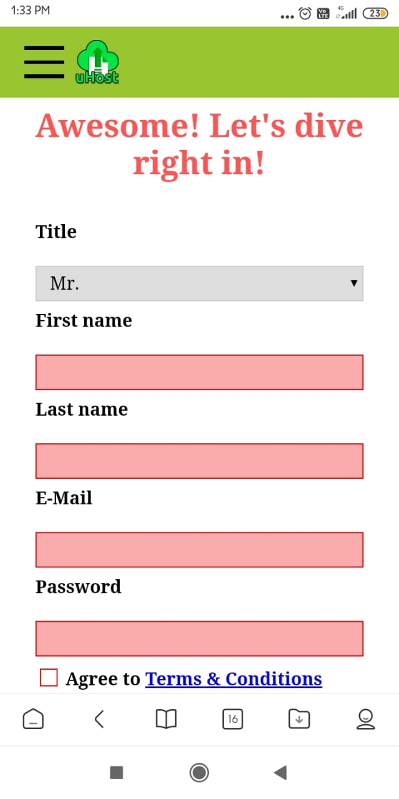

# uHost  

It is a Responsive Web Application for a fictional hosting company **uHost** which provides web hosting services.

## uHost Plans 📜

If you’re planning on creating an online presence, reliable web hosting is essential.Plans range from free with limited options to expensive web hosting services specialized for business. The plan you choose will depend primarily on how you plan to use your website and how much you have budgeted for hosting.

Choosing the right hosting plan will mean having access to the right allocation of resources to keep your website loading quickly and reliably for your visitors. Think about how many businesses these days operate primarily online; their sales and business leads come from their website.

## Getting Started ✨
You can download the zipped file of the project, extract it, and simply double-click the index.html file in the root folder in order to have it open in your default browser. You can alternatively just click the live demo link below to view the project.

If you are a **freelancer** and searching for a web hosting site then try [uHost](https://rudrakshi99.github.io/uHost/index.html).

## ScreenShots 📸

 
 <b> Laptop View 💻 </b> 

  

  

  

 
 <b> Mobile View 📱 </b> 

 
 

  
  
   

## Show your Support
Give a ⭐️ if you like this project !
